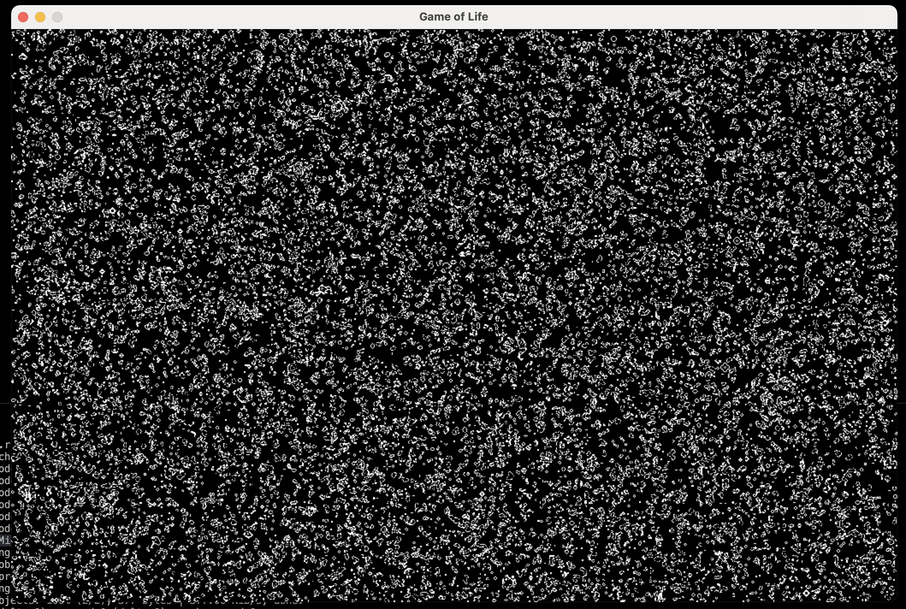

# Project Name: Game of Life

## Description
This project is an implementation of Conway's Game of Life in Rust. The Game of Life is a cellular automaton that simulates the evolution of a population of cells based on a set of rules. It is a zero-player game, meaning that its evolution is determined by its initial state, requiring no further input.

## Features
- Interactive grid where users can toggle cells on and off
- Customizable grid size and cell colors
- Generation counter to keep track of the evolution
- Play, pause, and reset functionality

## Installation
1. Clone the repository: `git clone https://github.com/your-username/game-of-life.git`
2. Navigate to the project directory: `cd game-of-life`
3. Build the project: `cargo build`
4. Run the project: `cargo run`

## Usage
2. Use the mouse to toggle cells on and off.
3. Press the spacebar to start or pause the simulation.
4. Press the R key to reset the grid.

## Contributing
Contributions are welcome! If you have any ideas, suggestions, or bug reports, please open an issue or submit a pull request.

## License
This project is licensed under the MIT License. See the [LICENSE](LICENSE) file for more details.
